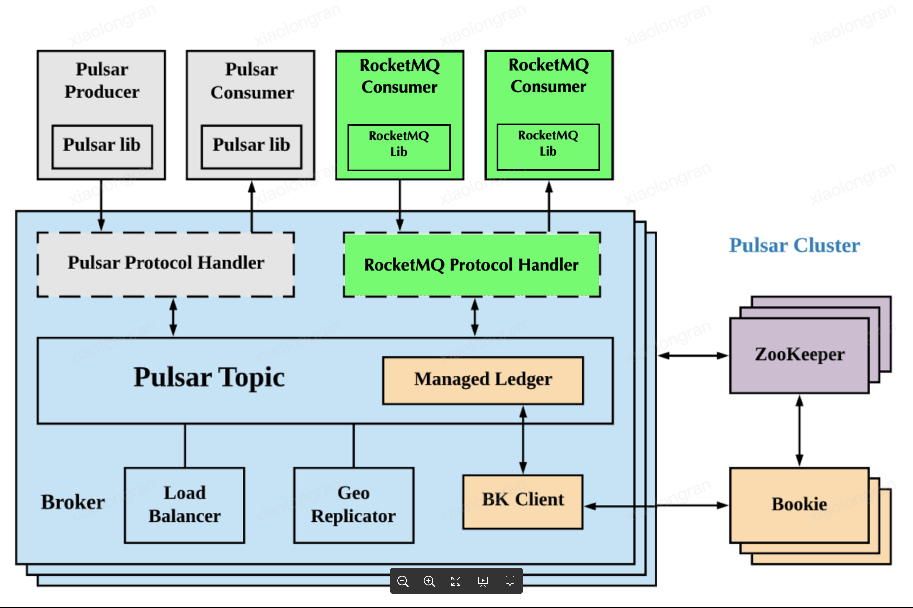

# RocketMQ on Pulsar(RoP)

RoP stands for RocketMQ on Pulsar. Rop broker supports RocketMQ-4.6.1 protocol, and is backed by
Pulsar.

RoP is implemented as a
Pulsar [ProtocolHandler](https://github.com/apache/pulsar/blob/master/pulsar-broker/src/main/java/org/apache/pulsar/broker/protocol/ProtocolHandler.java)
with protocol name "rocketmq". ProtocolHandler is build as a nar file, and is loaded when Pulsar
Broker starts.



## Supported

RoP is implemented based on Pulsar features. Currently, the functions supported by RoP are as follows:

- Send and Receive Messages
- SendAsync Messages
- Queue Selector Producer
- Round Robin Producer  
- Producer And Consumer(Push and Pull) With Namespace  
- Batch Messages
- Order Messages
- Send And Receive With Tag
- Deliver Level Message
- Retry Topic
- DLQ Topic
- Broadcast Consumer

## Get started

In this guide, you will learn how to use the Pulsar broker to serve requests from RocketMQ client.

### Download Pulsar

Download [Pulsar 2.7.1](https://github.com/streamnative/pulsar/releases/download/v2.7.1/apache-pulsar-2.7.1-bin.tar.gz)
binary package `apache-pulsar-2.7.1-bin.tar.gz`. and unzip it.

> Note: Currently, RoP is only compatible with Apache Pulsar 2.7.0 and above.

### Download and Build RoP Plugin

You can download rop nar file from the [RoP sources](https://github.com/streamnative/rop).

To build from code, complete the following steps:

1. Clone the project from GitHub to your local.

```bash
git clone https://github.com/streamnative/rop.git
cd rop
```

2. Build the project.

```bash
mvn clean install -DskipTests
```

You can find the nar file in the following directory.

```bash
./target/pulsar-protocol-handler-rocketmq-${version}.nar
```

### Configuration

|Name|Description|Default|
|---|---|---|
rocketmqTenant|RocketMQ on Pulsar broker tenant|rocketmq
rocketmqMetadataTenant|The tenant used for storing Rocketmq metadata topics|rocketmq
rocketmqNamespace|Rocketmq on Pulsar Broker namespace|default
rocketmqMetadataNamespace|The namespace used for storing rocket metadata topics|__rocketmq
rocketmqListeners|RocketMQ service port|rocketmq://127.0.0.1:9876
rocketmqMaxNoOfChannels|The maximum number of channels which can exist concurrently on a connection|64
rocketmqMaxFrameSize|The maximum frame size on a connection|4194304 (4MB)
rocketmqHeartBeat|The default heartbeat timeout of RoP connection|60 (s)

### Configure Pulsar broker to run RoP protocol handler as Plugin

As mentioned above, RoP module is loaded with Pulsar broker. You need to add configs in Pulsar's
config file, such as `broker.conf` or `standalone.conf`.

1. Protocol handler configuration

You need to add `messagingProtocols`(the default value is `null`) and  `protocolHandlerDirectory` (
the default value is "./protocols"), in Pulsar configuration files, such as `broker.conf`
or `standalone.conf`. For RoP, the value for `messagingProtocols` is `rocketmq`; the value
for `protocolHandlerDirectory` is the directory of RoP nar file.

The following is an example.

```access transformers
messagingProtocols=rocketmq
protocolHandlerDirectory=./protocols
```

2. Set RocketMQ service listeners

Set RocketMQ service `listeners`. Note that the hostname value in listeners is the same as Pulsar
broker's `advertisedListeners`.

The following is an example.

```
rocketmqListeners=rocketmq://127.0.0.1:9876
advertisedListeners=INTERNAL:pulsar://127.0.0.1:6650,INTERNAL:pulsar+ssl://127.0.0.1:6651,INTERNAL_ROP:pulsar://127.0.0.1:9876,INTERNAL_ROP:pulsar+ssl://127.0.0.1:9896
rocketmqListenerPortMap=9876:INTERNAL_ROP
```

> Note: `advertisedListeners` and `advertisedAddress` cannot be configured at the same time.

### Run Pulsar broker

With the above configuration, you can start your Pulsar broker. For details, refer
to [Pulsar Get started guides](http://pulsar.apache.org/docs/en/standalone/).

```access transformers
cd apache-pulsar-2.7.1
bin/pulsar standalone -nss -nfw
```

### Run RocketMQ Client to verify

In the RoP repo, we provide a sub model of `examples`, which contains a variety of scenarios used by the rocketmq client. You can run these examples directly in the IDE. Or you can download the RocketMQ src code and run RocketMQ client of `examples`.

### Log level configuration

In Pulsar [log4j2.yaml config file](https://github.com/apache/pulsar/blob/master/conf/log4j2.yaml),
you can set RoP log level.

The following is an example.

```
    Logger:
      - name: RocketMQProtocolHandler
        level: debug
        additivity: false
        AppenderRef:
          - ref: Console
```

